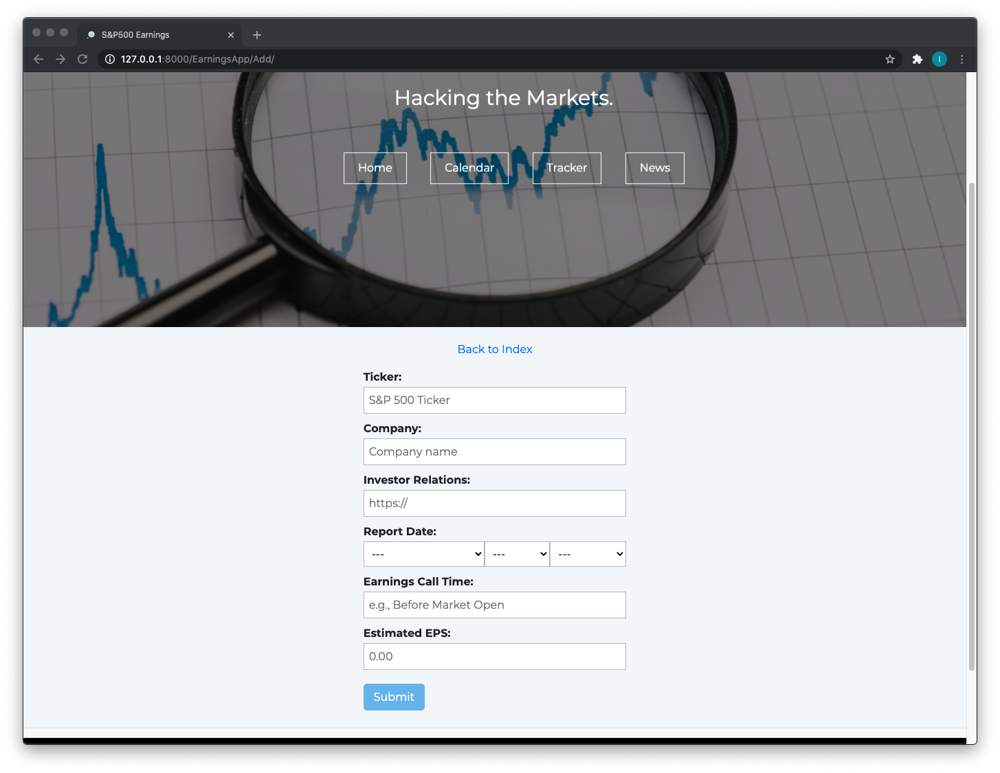
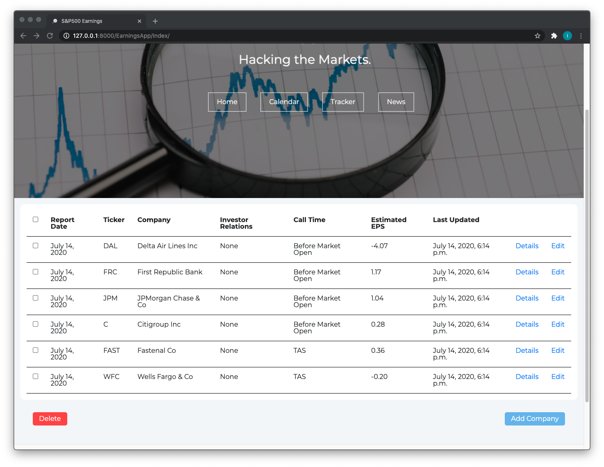
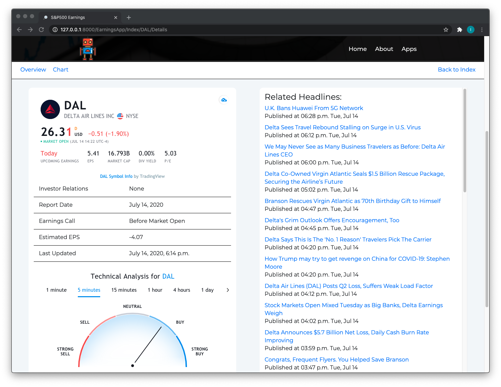
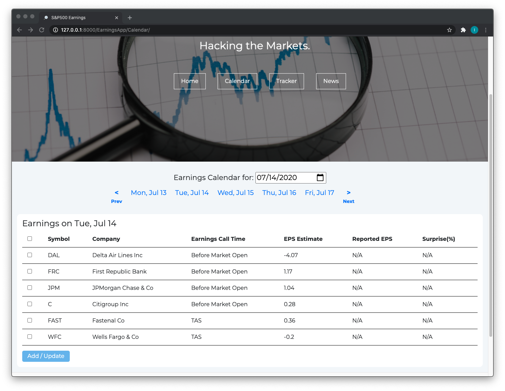
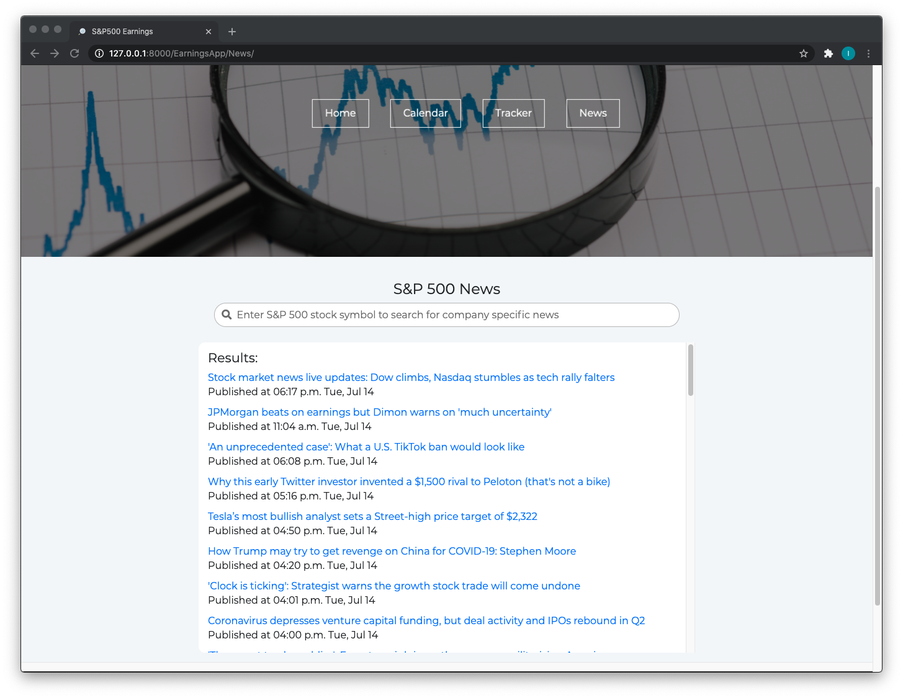
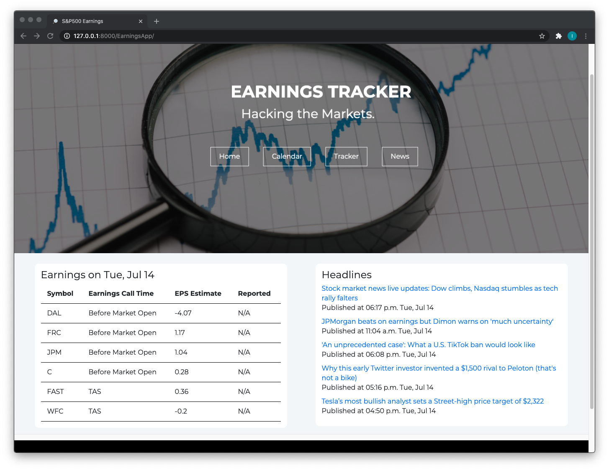

# The Tech Academy Live Project


* [Introduction](#introduction)
* [Database Collection Manager](#database-collection-manager)
* [Data Scraping with Beautiful Soup](#data-scraping-with-beautiful-soup)
* [Restful API interface](#restful-api-interface)
* [Other Skills Used ](#other-skills-used)
* [Future Plans](#future-plans)

## Introduction

Welcome to my Live Project repository. This project was built using the Django framework. I was tasked with building an interactive web app for managing one's
collections of things related to various hobbies, as well as API and Data Scraped content for those hobbies.

There were 3 distinct portions of the app with individual stories covering each portion: a Database Collection Manager, Data Scraping with Beautiful Soup and a Restful API interface.

The tool set for the project consisted of the following Python packages: beautifulsoup4 4.7.1; certifi 2018.11.29; chardet 3.0.4; Django 2.1.5; idna 2.8; numpy 1.16.2; pytz 2018.9; requests 2.21.0; selenium 3.141.0; soupsieve 1.7.2; urllib3 1.24.1.

## Database Collection Manager

Specifically, my web app focused on tracking S&P 500 quarterly earnings report data. For context, the S&P 500 is an index of 500 large companies list on US stock exchanges.

I created a django model and model form for saving company data to the database and developed basic "CRUD" functionality. 



```python
class Company(models.Model):
    ticker = UpperCharField(max_length=10, unique=True)
    company = models.CharField(max_length=30)
    investor_url = models.URLField(blank=True, null=True)
    report_date = models.DateField(blank=True, null=True)
    earnings_call = models.CharField(max_length=30, blank=True, null=True)
    estimated_eps = models.DecimalField(max_digits=4, decimal_places=2, blank=True, null=True)
    last_updated = models.DateTimeField(auto_now=True)

    @classmethod
    def create(cls, value):
        company = cls(ticker=value['symbol'],
                      company=value['company'],
                      investor_url=None,
                      report_date=value['report_date'],
                      earnings_call=value['calltime'],
                      estimated_eps=value['estimate'])
        return company

    companies = models.Manager()
    
class CompanyForm(ModelForm):
    class Meta:
        model = Company
        fields = ['ticker', 'company', 'investor_url', 'report_date', 'earnings_call', 'estimated_eps']
        labels = {
            'investor_url': _('Investor Relations'),  # change label strings
            'report_date': _('Report Date'),
            'estimated_eps': _('Estimated EPS'),
            'earnings_call': _('Earnings Call Time'),

        }
        widgets = {
            'ticker': TextInput(attrs={'placeholder': 'S&P 500 Ticker'}),  # apply placeholder attributes
            'company': TextInput(attrs={'placeholder': 'Company name'}),
            'investor_url': URLInput(attrs={'placeholder': 'https://'}),
            'report_date': SelectDateWidget(),  # add date-picker
            'earnings_call': TextInput(attrs={'placeholder': 'e.g., Before Market Open'}),
            'estimated_eps': NumberInput(attrs={'placeholder': '0.00'})
        }
```



I wrote the views and templates necessary to handle requests and display the data from the database. Users can add, edit and remove companies from the database. Multiple companies can be removed at once from the Index page.

```python
def index(request):
    if request.method == 'POST':
        values = request.POST.getlist('checks')  # retrieves the values of all the checked checkboxes
        if values:  # if any boxes where checked
            for ticker in values:  # get the company from the database and delete it
                company = get_object_or_404(Company, ticker=ticker)
                company.delete()
            return redirect('index')
        else:
            return redirect('index')
    else:
        get_companies = Company.companies.all()  # get all items from the database
        context = {'companies': get_companies}  # package items to be sent to template
        return render(request, 'EarningsApp/earningsapp_index.html', context)


def add_company(request):  # view function to display Company ModelForm for adding companies
    if request.method == 'POST':  # if the user is submitting a form
        form = CompanyForm(request.POST)
        if form.is_valid():
            ticker = request.POST.get('ticker')
            if in_sp500(ticker):
                form.save()
                return redirect('index')  # redirect to index if form is valid
            else:
                error_message = f'{ticker} is not a component of the S&P 500'
                form = CompanyForm(request.POST)
                context = {'form': form, 'error_message': error_message}
                return render(request, 'EarningsApp/earningsapp_add.html', context)
    else:
        form = CompanyForm()  # render the form
    return render(request, 'EarningsApp/earningsapp_add.html', {'form': form})
    
def edit_company(request, ticker):
    ticker = str(ticker)
    company = get_object_or_404(Company, ticker=ticker)
    if request.method == 'POST':
        form = CompanyForm(request.POST, instance=company)
        value = request.POST.get('submit')
        if value == "Submit":
            if form.is_valid():
                tkr = request.POST.get('ticker')
                if in_sp500(tkr):
                    form.save()
                    return redirect('index')  # redirect to index if form is valid
                else:
                    error_message = f'{tkr} is not a component of the S&P 500'
                    context = {'form': form, 'error_message': error_message}
                    return render(request, 'EarningsApp/earningsapp_edit.html', context)
        if value == "Delete":
            company.delete()
            return redirect('index')
    else:
        form = CompanyForm(instance=company)
    context = {'form': form, 'ticker': ticker, 'company': company}
    return render(request, 'EarningsApp/earningsapp_edit.html', context)
```

I used the Django Template language to present the data on page templates. For example, below is the template for the tracker page:

```html




<div class="page-container">
     <!-- if there are items in the database, insert them into a table -->
    <div class="table-container index-container">
        <table id="index-table" class="primary-table">
            <tr>
                <th><input type="checkbox" onClick="select_all(this)"></th>
                <th>Report Date</th>
                <th>Ticker</th>
                <th>Company</th>
                <th>Investor Relations</th>
                <th>Call Time</th>
                <th>Estimated EPS</th>
                <th>Last Updated</th>
                <th></th>
                <th></th>
            </tr>
                  <!-- django loops through database items -->
                <tr>  <!-- and creates a table row for each item -->
                    <!-- creates a checkbox for each item with the ticker as the value to be passed with the POST request -->
                    <td><input name="checks" type="checkbox" value="{{ company.ticker }}" onclick="box_checked(this)" form="delete"></td>
                    <td>{{ company.report_date }}</td>
                    <td>{{ company.ticker }}</td>
                    <td>{{ company.company }}</td>
                    <td>
                        <a href="{{ company.investor_url }}" target="_blank"><i class="fas fa-external-link-alt"></i></a>
                        
                        {{ company.investor_url }}
                        
                    </td>
                    <td>{{ company.earnings_call }}</td>
                    <td>{{ company.estimated_eps }}</td>
                    <td>{{ company.last_updated }}</td>
                    <td><a href="">Details</a></td>
                    <td><a href="">Edit</a></td>
                </tr>
                
        </table>
    </div>
    
    <div id="btn-container">
        
        <!-- submit button for the checkbox delete function -->
        <input disabled id="checkbox-btn" name="delete" onclick="open_modal()" type="button" value="Delete">
        
        <p>You haven't added any companies yet. Click the button to get started!</p>
        
        <input name="add" type="button" value="Add Company" onclick="window.location.href='';">
    </div>
    <!-- Delete confirmation modal -->
    <div class="modal-container">
        <div class="delete-modal">
            <div class="modal-content hide">
                <h1>Delete Item(s)</h1>
                <p>Are you sure you want to delete the selected item(s)?</p>
                <form id="delete" method="POST">
                    
                    <div class="modal-buttons">
                        <input name="submit" type="submit" value="Delete">
                        <input type="button" value="Cancel" onclick="close_modal()">
                    </div>
                </form>
            </div>
        </div>
    </div>
    <!-- end modal -->
</div>


```




This included a details page that featured widgets providing more in depth data.
```python
# this view renders the details page and all sub-pages linked on the details page
def company_details(request, ticker):
    ticker = str(ticker)
    company = get_object_or_404(Company, ticker=ticker)
    context = {'company': company}
    category = ticker
    stock_news = get_news(category)
    context.update(stock_news)
    if request.path == f'/EarningsApp/Index/{ticker}/Details/Chart':
        return render(request, 'EarningsApp/earningsapp_details_chart.html', context)
    else:
        return render(request, 'EarningsApp/earningsapp_details.html', context)
```

## Data Scraping with Beautiful Soup



I used Beautiful Soup to scrap data from Yahoo Finance: https://finance.yahoo.com/calendar/earnings. Users can save the scraped data to the database. I wanted to allow the User to not only view the data for any given day, but also each day on any given week, and be able to navigate from one week to the next. This required me to understand how Yahoo Finance handles requests, and then write a function to define the necessary parameters for a request. Then I was able to pass those parameters to a different function that made the page request and scrape the desired data from the page.

Below is the view function for the Calendar page:

```python
def calendar(request):
    if request.method == 'POST':
        report_date = request.POST.get('report_date')
        report_date = datetime.datetime.strptime(report_date, '%Y-%m-%d')
        report_date_dict = {'report_date': report_date}
        values = request.POST.getlist('checks')
        if values:
            for value in values:
                value = ast.literal_eval(value)
                value.update(report_date_dict)
                try:
                    company = Company.companies.get(ticker=value['symbol'])
                    company.company = value['company']
                    company.report_date = value['report_date']
                    company.earnings_call = value['calltime']
                    company.estimated_eps = value['estimate']
                    company.save()
                except Company.DoesNotExist:
                    company = Company.create(value)
                    company.save()
        params, week_dates = get_params(report_date)
        # page request with the parameters defined above
        company_earnings = scrape_earnings(params)
        confirmation_msg = "The selected item(s) has/have been added/updated."
        context = {
            'market_time': report_date,
            'week_dates': week_dates,
            'company_earnings': company_earnings,
            'confirmation_msg': confirmation_msg
        }
        return render(request, 'EarningsApp/earningsapp_calendar.html', context)
    # declare datetime_object to be passed as an argument to get_params()
    date_obj = timezone.now()
    # if a specific date was requested along with the page, convert the string to a datetime obj
    date_str = request.GET.get('date')
    if date_str:
        date_obj = datetime.datetime.strptime(date_str, '%Y-%m-%d')
    # utility function to automatically define parameters
    params, week_dates = get_params(date_obj)
    # page request with the parameters defined above
    company_earnings = scrape_earnings(params)
    context = {'market_time': date_obj, 'week_dates': week_dates, 'company_earnings': company_earnings}
    return render(request, 'EarningsApp/earningsapp_calendar.html', context)

```
Here is the function to define the request parameters based on any given day:
```python
def get_params(date_obj=timezone.now()):
    date_iso = date_obj.isocalendar()
    # an iso week starts on Monday, but Yahoo finance's week starts on Sunday
    # so we use the isocalendar() method to determine which day of the week
    # is being requested and we establish the params from there.
    if date_iso[2] == 7:  # if the date_obj is a Sunday
        week_start = date_obj.date()
        week_end = week_start + timedelta(days=6)
        day = date_obj.date()
    else:
        monday = datetime.date.fromisocalendar(date_iso[0], date_iso[1], 1)  # inverse of isocalendar() to get date obj
        week_start = monday - timedelta(days=1)
        week_end = datetime.date.fromisocalendar(date_iso[0], date_iso[1], 6)
        day = date_obj.date()
    params = {'from': f'{week_start}', 'to': f'{week_end}', 'day': f'{day}'}
    # next, we create a list of the days of the selected week to pass to the template for the nav bar links
    day_counter = week_start
    prev_monday = week_start - timedelta(days=6)  # we use Monday because we don't want
    next_monday = week_start + timedelta(days=8)  # to display results for Sunday (because the market is closed)
    week_dates = [prev_monday, next_monday]
    i = 1
    while i < 6:
        # we insert the days at the index corresponding to their iso values i.e. 1 = mon, 2 = tues, etc.
        day_counter += timedelta(days=1)
        week_dates.insert(i, day_counter)
        i += 1
    return params, week_dates
```
And this is the function that makes the page request and scrapes the data:
```python
def scrape_earnings(params):
    response = requests.get("https://finance.yahoo.com/calendar/earnings", params=params)
    soup = bs(response.content, "html.parser")  # parse web page for dissecting
    try:  # if there is data to be found at the specified id, create a list of dicts for the template to display
        earnings_table = soup.find(id="cal-res-table")  # identifier for earnings table data
        earnings_tbody = earnings_table.find('')
        earnings_rows = earnings_tbody('tr')
        company_earnings = []
        for row in earnings_rows:
            string_list = []
            for string in row.strings:
                string_list.append(string)
            if in_sp500(string_list[0]):
                company_data = {"symbol": string_list[0],
                                "company": string_list[1],
                                "calltime": string_list[2],
                                "estimate": string_list[3],
                                "reported": string_list[4],
                                "surprise": string_list[5]
                                }
                company_earnings.append(company_data)
    except TypeError:  # if there isn't any data found, pass an empty list to the template
        company_earnings = []
    except AttributeError:
        company_earnings = []
    return company_earnings
```
## Restful API interface



I used the Yahoo finance API from rapidapi.com to request news articles relating to S&P 500 companies. Below is the function I wrote to extract a list of articles from the json response:
```python
def get_news(category):
    url = "https://apidojo-yahoo-finance-v1.p.rapidapi.com/news/list"
    querystring = {"category": category, "region": "US"}
    headers = {
        'x-rapidapi-host': RAPIDAPI_HOST,
        'x-rapidapi-key': RAPIDAPI_KEY
    }
    response = requests.get(url, headers=headers, params=querystring)
    try:
        data = response.json()
        articles = []
        for item in data['items']['result']:
            article = {
                'title': item['title'],
                'link': item['link'],
                'date': datetime.datetime.fromtimestamp(item['published_at'])
            }
            articles.append(article)
    except KeyError:
        error_msg = "Couldn't connect to the API. Please try again."
        context = {'error': error_msg}
        return context
    context = {'articles': articles}
    return context
```
I created a view for a dedicated news page that also allows the User to search for headlines by stock symbol:
```python
def news(request):
    symbol = request.GET.get('symbol')
    category = "generalnews"
    if symbol:
        if in_sp500(symbol):
            category = symbol
        else:
            error_msg = "Please enter a valid S&P 500 stock symbol."
            context = {'error': error_msg}
            return render(request, 'EarningsApp/earningsapp_news.html', context)
    context = get_news(category)
    return render(request, 'EarningsApp/earningsapp_news.html', context)
```



And I also used it in combination with the data scraping function on the homepage:
```python
def home(request):
    date_obj = timezone.now()  # + timedelta(days=11) # for testing
    params, week_dates = get_params(date_obj)
    company_earnings = scrape_earnings(params)
    context = {'market_time': date_obj, 'week_dates': week_dates, 'company_earnings': company_earnings}
    category = "generalnews"
    top_five = get_news(category)
    top_five['articles'] = top_five['articles'][:5]
    context.update(top_five)
    return render(request, "EarningsApp/earningsapp_home.html", context)
```

## Other Skills Used

HTML/CSS and JavaScript to write templates and add improvements to the UI/UX. This included styling, hover effects, pop-ups, animations.

Team work and internal communication

Daily stand-ups

Retrospective and sprint review

Working in PyCharm and Microsoft Azure DevOps

Checking in and pushing code daily

## Future plans

I created this web app to automate a process that I personally go through. I intend on turning this project into a fully functioning web app that will aggregate free stock market data to enable trading strategies that profit from the share price movements caused by the earnings season.
